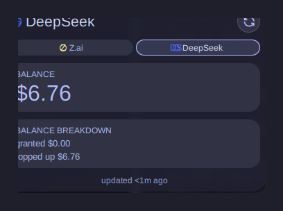
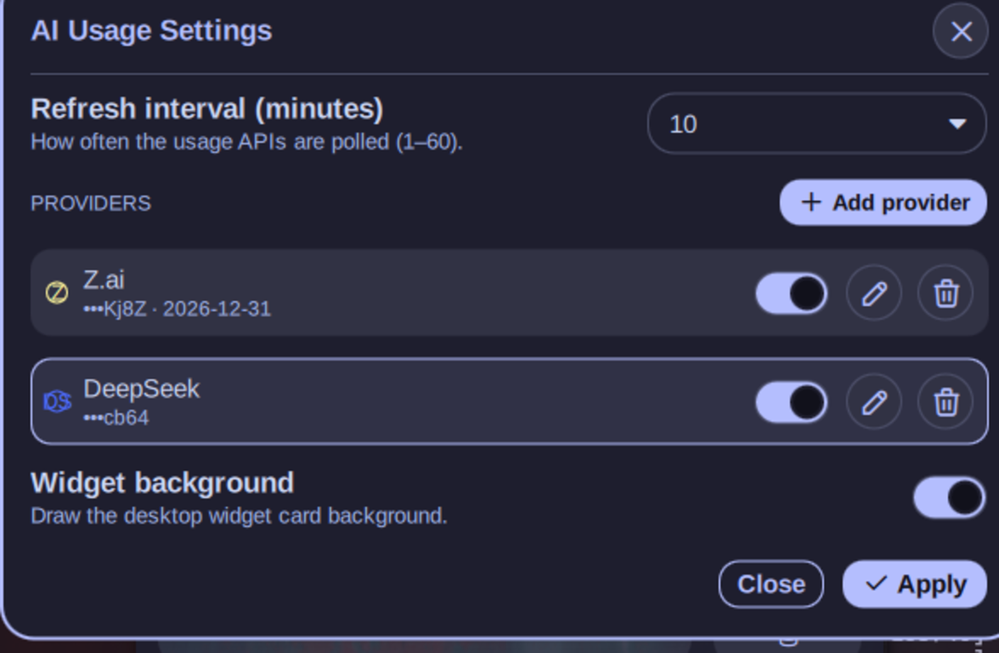

# AI Usage — multi-provider AI quota monitor for Noctalia Shell

    

Quotas, balances, reset countdowns and plan validity for **six AI providers in one card** —
on your desktop, in the bar, in the Control Center and in a tabbed detail panel.
API keys are **encrypted at rest**; the Claude provider needs **no key at all** (reuses
the `claude` CLI login).

## Screenshots

**Bar capsule** — one segment per enabled provider; click a segment to switch and open the panel:


**Panel** — tabbed per-provider detail (balance/quota, breakdown, reset countdown, data age):



**Settings** — provider CRUD, encrypted keys shown by their last-4 hint:



## Features

- **Six providers side by side** — active one headlines the widgets, others are one click away
- **Bar capsule** lists every enabled provider (`chip + value`); click a segment to make it
  active and open the panel; failing providers show ⚠, stale cached values are dimmed
- **Panel** with per-provider tabs: session/weekly windows, per-model limits, balances,
  per-tool breakdown, reset timestamps and "cached" annotations
- **Reset countdowns** in your local timezone; severity colors (low → mid → high → critical)
- **Plan validity dates** — set `valid until` and the card warns when ≤ 7 days remain
- **Encrypted key storage** — AES-256-CBC + PBKDF2 (600k iterations), machine-bound;
  integrity-checked with HMAC-SHA256; decrypted only at request time
- **Keyless Claude** — reuses the official `claude` CLI OAuth login, auto-refreshes tokens
- **Tolerant parsers** — every provider response is parsed defensively; a broken endpoint
  degrades to the last good value instead of crashing the widget

## Providers

| Provider | Auth | Shows | Endpoint |
|---|---|---|---|
| **z.ai** | API key | 5h session window %, weekly quota, per-tool (MCP) usage | `api.z.ai` · undocumented |
| **DeepSeek** | API key | balance, granted/topped-up breakdown, USD/CNY | `api.deepseek.com` · documented |
| **OpenRouter** | API key | credits balance, consumption %, key meta (label, limits) | `openrouter.ai` · documented |
| **Kimi** | API key | session window + weekly quota | `api.kimi.com` · community-confirmed |
| **Claude** | `claude` CLI login | 5h/7d windows, per-model limits (e.g. *Sonnet weekly*), extra-usage $ balance, plan label (e.g. *Max 5x*) | `api.anthropic.com` · used by official CLI |
| **Anthropic** | Admin API key | month-to-date spend $ | `api.anthropic.com` · documented (Admin API) |

z.ai, Kimi and Claude endpoints are undocumented/reverse-engineered and treated as fragile:
parsing is defensive and degrades gracefully.

## Install

**Requirements**

- [Noctalia Shell](https://docs.noctalia.dev) ≥ 3.7.1 (Quickshell-based)
- `openssl` and `curl` (key encryption, Claude/Anthropic fetch)
- optional: [`claude` CLI](https://claude.com/claude-code) logged in — only for the Claude provider

**Steps**

```bash
git clone https://github.com/apilot/ai-usage ~/.config/noctalia/plugins/ai-usage
```

Restart the shell (`qs -c noctalia-shell`) and enable **AI Usage** in
Noctalia Settings → Plugins (or add `"ai-usage": {"enabled": true}` to the `states`
object of `~/.config/noctalia/plugins.json` and restart again).

Then open the plugin's **Settings**, press **Add provider**, pick a type and go —
see [Configure](#configure).

**Update** — `git -C ~/.config/noctalia/plugins/ai-usage pull` and restart the shell.
**Uninstall** — remove the plugin in Noctalia Settings, delete the directory.
Provider data lives in `~/.config/noctalia/plugins/ai-usage/settings.json` (keys are
irreversibly encrypted — deleting the file deletes them).

## Usage

| Surface | Entry | How |
|---|---|---|
| Bar | `barWidget` | Bar settings → widgets → **AI Usage**. Capsule with one segment per enabled provider; click a segment = switch active + open panel |
| Panel | `panel` | Opens from the bar capsule or the Control Center tile. One tab per provider, cache-annotated metrics |
| Desktop | `desktopWidget` | Edit mode → drag **AI Usage** anywhere; toggle background in settings |
| Control Center | `controlCenterWidget` | CC settings → **Shortcuts** → add **AI Usage**. Tile shows the active headline; tooltip carries the error if the last fetch failed |
| Settings | `settings` | Noctalia Settings → Plugins → AI Usage |

## Configure

1. **Add provider** — pick a type; for keyed providers paste the **API key**
   (it is encrypted immediately). For **Claude** there is no key field — just
   log in with the `claude` CLI on this machine.
2. Optionally set a **display name**, a **plan override** (`pro`, `lite`… — overrides
   the label the API reports) and **valid until** (`YYYY-MM-DD`).
3. Click a provider row to make it the **active** one; the pencil **edits** it, the
   toggle disables it without deleting, the trash removes it.

| Setting | Meaning |
|---|---|
| Providers | list of `{type, apiKey (encrypted), label, planLabel, validUntil, enabled}` |
| Refresh interval | 1–60 min, default 5 — applies live, no restart needed |
| Widget background | card background on the desktop |

**Editing keys safely** — the stored key is never loaded back into the form; you only
see its masked tail (`•••Kj8Z`). Submitting an empty key field **keeps** the stored key;
pasting a new one replaces it.

## Security & privacy

- Keys are stored as `enc:v1:<blob>:<hmac>:<hint>` envelopes —
  **AES-256-CBC + PBKDF2 (600 000 iterations)** via `openssl`, passphrase derived from
  the machine id + your uid, so a copied `settings.json` is useless on another machine.
- **HMAC-SHA256** integrity check: tampered/corrupted envelopes are rejected.
- The last 4 characters of each key stay visible (`hint`) so you can tell keys apart.
- Plaintext exists **only for the duration of an HTTP request**; secrets are passed to
  subprocesses via environment/pipe, never on the command line. `settings.json` and the
  Claude credentials file are kept at `chmod 600`.
- **Honest threat model**: this protects keys in backups, dotfile sync and file exfiltration.
  It is *not* a defense against malware running as your user (the passphrase is locally
  derivable by design — there is no interactive unlock in a shell widget).
- **Network**: the plugin talks **only** to the provider endpoints listed above.
  No telemetry, no analytics, no other hosts. Claude/Anthropic traffic goes through
  `curl` with certificate verification on; all other providers use QML `XMLHttpRequest`.
- Claude OAuth tokens are read from and written back to `~/.claude/.credentials.json`
  (the CLI's own file, `chmod 600`) — the plugin refreshes them when they expire and
  persists rotations, exactly like the CLI does.

## Development

```
Logic.js               pure data layer — parsers, migration, crypto primitives (no Qt)
Main.qml               service: fetch/XHR/curl, encryption, provider state
BarWidget/Panel/DesktopWidget/ControlCenterWidget/Settings.qml + UsageBar, ProviderChip
i18n/{en,ru}.json
tests/logic.test.mjs   62 unit tests (node, zero deps) — includes FIPS/RFC crypto vectors
tests/bench/           offline QML smoke harness: stubs the design system and
                       instantiates all 6 entry points; run from the repo root:
                       env QT_QPA_PLATFORM=offscreen timeout 25 qs -p tests/bench
```

Workflow is TDD: logic changes start as a failing test in `tests/logic.test.mjs`.
QML constraints (Quickshell's Qt version): no optional `catch {}` binding, no `\p{}`
regexes, no anchors inside Row/Column layouts.

## Attribution & license

MIT — see [LICENSE](LICENSE). The usage-bar visual language and the provider-endpoint
research are based on [akitaonrails/ai-usagebar](https://github.com/akitaonrails/ai-usagebar)
(MIT); its Rust core is *not* used — everything runs natively in the shell.
