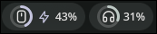
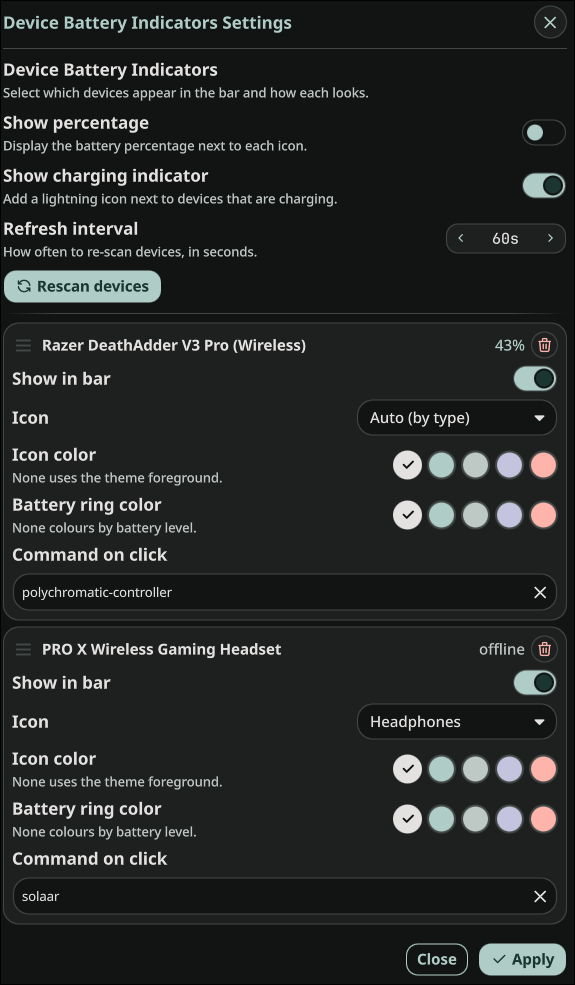

# Battery for Wireless Devices

A [Noctalia](https://noctalia.dev) bar widget that shows battery levels for your
connected peripherals — mouse, keyboard, headset, etc. — each as a device icon
inside a circular battery ring.



Battery data is gathered by a small Python script (`scripts/scan.py`) that talks
to vendor tools, so it works for devices the shell's Bluetooth/UPower services
can't see (wireless dongles, USB receivers, ...).

> **Supported devices:** currently **Razer** (via OpenRazer) and **Logitech**
> (via Solaar). Other sources are easy to add — see
> [Adding a new device source](#adding-a-new-device-source).

## Features

- One pill per device: a device icon inside a circular battery ring.
- Ring colour follows the battery level by default (green → amber → red), or pick
  a fixed theme colour. The icon colour is configurable too.
- Optional battery percentage and a charging (⚡) indicator.
- Per-device click command (e.g. open Polychromatic or Solaar).
- Drag-and-drop ordering; tooltips; right-click for settings / manual refresh.
- Theme- and scale-aware (uses Noctalia's `Style`/`Color`), works on horizontal
  and vertical bars.

## Requirements

- **Noctalia** ≥ 4.6.6
- **python3**
- Per device source (install only what you need):
  - **Razer** — [OpenRazer](https://openrazer.github.io/): the running
    `openrazer-daemon` and the `openrazer` Python client.
  - **Logitech** — [Solaar](https://pwr-solaar.github.io/Solaar/): the `solaar`
    command must be on `PATH`.

The plugin degrades gracefully: if a tool isn't installed, that source simply
reports no devices.

## Installation

**From the Noctalia plugin browser (recommended)**

Open Noctalia's settings → Plugins, find **Battery for Wireless Devices**, and
install it.

**Manual / development**

Clone this repository and symlink the plugin folder into Noctalia's plugin
directory (so edits stay live):

```sh
git clone https://github.com/noctalia-dev/noctalia-plugins
ln -s "$PWD/noctalia-plugins/battery-wireless-devices" \
  ~/.config/noctalia/plugins/battery-wireless-devices
```

Then, however you installed it:

1. Enable **Battery for Wireless Devices** in Noctalia's plugin settings.
2. Restart the shell (`qs -c noctalia-shell`) so the new plugin is registered.
3. Add the **Battery for Wireless Devices** widget to a bar section
   (Noctalia Settings → Bar).
4. Open the plugin's settings (see below) and enable the devices you want.

The bar shows nothing until at least one device is enabled.

## Usage & settings

Open the settings from the plugin list, or right-click any of the widget's icons
→ **Settings**.



**Global options**

| Option | Description |
| --- | --- |
| Show percentage | Show the battery % next to each icon. |
| Show charging indicator | Add a ⚡ icon next to devices that are charging. |
| Refresh interval | How often to re-scan devices, in seconds. |
| Rescan devices | Trigger an immediate scan and refresh the list. |

**Per device** (drag the handle on the left to reorder — top = left-most /
top-most in the bar):

| Option | Description |
| --- | --- |
| Show in bar | Whether this device appears in the bar. |
| Icon | Device icon (or *Auto* to pick one from the device type). |
| Icon color | Theme colour for the icon (*None* = theme foreground). |
| Battery ring color | Theme colour for the ring (*None* = colour by level). |
| Command on click | Shell command run on left-click (e.g. `polychromatic-controller`, `solaar`). |
| 🗑 | Remove the entry (useful for devices you no longer own). |

Changes apply live; the popup's **Apply** button is redundant.

You can also trigger a refresh over IPC:

```sh
qs -c noctalia-shell ipc call plugin:battery-wireless-devices refresh
```

## Adding a new device source

All device discovery lives in **`scripts/scan.py`**. It probes each source and
prints a normalized JSON array on stdout — nothing in the QML needs to change to
support a new source.

Each device object is:

```jsonc
{
  "id":       "<source>:<stable-key>", // stable across runs (used as the config key)
  "name":     "Human readable name",
  "type":     "mouse|keyboard|headset|gamepad|device", // picks the default icon
  "battery":  0-100,
  "charging": true,
  "source":   "openrazer|solaar|..."
}
```

To add a source:

1. Write a `scan_<source>()` that returns a list of these dicts. **Swallow all
   your own errors** (a missing tool should yield `[]`, never an exception).
2. Append it to the `SOURCES` list at the bottom of the file.

Verify it independently:

```sh
python3 scripts/scan.py | python3 -m json.tool
```

Pick a **stable** `id` — one that survives reboots and reconnects. Avoid values
that drift: the OpenRazer source keys on USB `vid:pid` rather than the daemon's
serial, which is often an unstable placeholder (e.g. `UNKNOWN_153200B7_0000`).
Detected entries whose `id` drifts are auto-merged in the settings UI by
`source` + `name`, but a stable id is always better.

## Contributing

This plugin lives in the
[noctalia-plugins](https://github.com/noctalia-dev/noctalia-plugins) registry —
please open issues and pull requests there. New `scan_<source>()` functions for
other vendors are especially welcome.

There's no build step or test framework: it's pure QML loaded at runtime by
Noctalia, plus the standalone Python scanner. See [`CLAUDE.md`](CLAUDE.md) for an
overview of the architecture, and the repository-root
[`AGENTS.md`](../AGENTS.md) for plugin conventions and the PR process.

## License

[MIT](LICENSE) © aslauw
