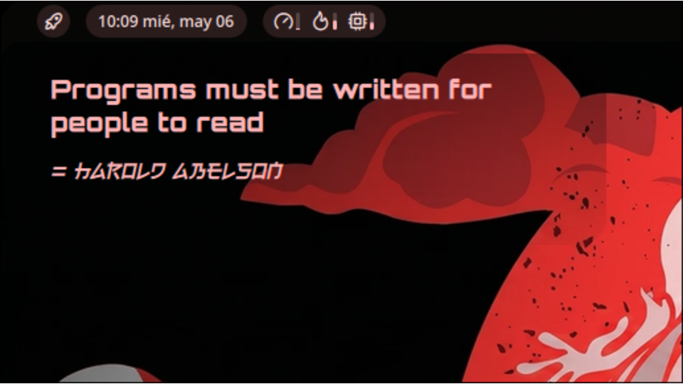

# Daily Quote

A desktop widget that displays a daily quote with a hacker-style scramble decode animation. Click anywhere on the widget to refresh with a new quote.

## Features

- **Scramble decode animation** — characters randomize then settle left-to-right with color transitions, like a terminal decrypting text
- **3 speed presets** — Fast, Medium, Slow (controls tick rate, iteration count, and reveal speed)
- **3 character sets** — Mix (alphanumeric + box-drawing), ASCII, Symbols (Unicode box-drawing characters)
- **Custom quotes** — add your own quotes with author, view and remove them from settings
- **Custom fonts** — separate font selectors for the quote text and author line
- **Theme-aware text colors** — choose from Primary, Secondary, Tertiary, Error, or None; colors automatically adapt to your color scheme and wallpaper
- **Text alignment** — Left, Center, or Right
- **Background options** — solid panel (default), gradient overlay, or fully transparent
- **Adaptive gradient overlay** — when background is off, a subtle gradient veil improves readability; auto-switches between black (dark mode) and white (light mode)
- **Daily auto-change** — automatically shows a new quote at midnight
- **Click to refresh** — click the widget at any time for a new quote with animation

## Settings

| Setting | Description | Default |
|---|---|---|
| **Your Quotes** | Add, view, and remove custom quotes | — |
| **Quote Font** | Font for the quote text (scramble + settled) | System monospace |
| **Author Font** | Font for the author line | System default |
| **Text Color** | Color key that adapts to your color scheme | Primary |
| **Text Alignment** | Horizontal alignment for quote and author | Left |
| **Show Background** | Solid panel with border and shadow | On |
| **Gradient Overlay** | Subtle veil behind text when background is off | On |
| **Gradient Direction** | Vertical or Horizontal | Vertical |
| **Decoding Speed** | Fast, Medium, or Slow | Medium |
| **Character Style** | Mix, ASCII, or Symbols | Mix |
| **Show Author** | Toggle the author line | On |
| **Daily Auto-Change** | New quote at midnight | On |

## Custom Quotes

You can add your own quotes through the settings panel. Quotes are stored in your widget data and persist across sessions.

Additionally, the built-in quote pool is loaded from `quotes.json` in the plugin directory. You can edit this file directly to change the default quotes — the widget will hot-reload when the file changes.

## Requirements

- Noctalia Shell 4.7.0 or later

## License

MIT

## Author

Vikthor
