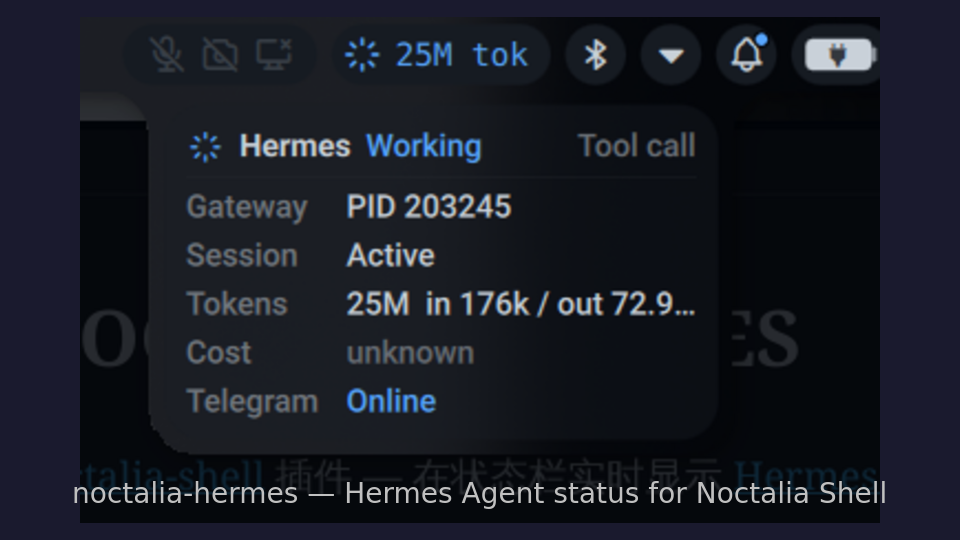

# noctalia-hermes

A [noctalia-shell](https://github.com/noctalia-dev/noctalia-shell) plugin that displays real-time [Hermes Agent](https://github.com/nousresearch/hermes-agent) status in the status bar.

Hermes shell hooks record lifecycle events, which the noctalia plugin listens to via a signal file for near-instant UI refresh. A low-frequency polling fallback is also included.
Hook writes typically complete in under 1 second; the status bar UI refreshes shortly after the signal file changes, with a default 30-second fallback check for Gateway/platform status.

## Preview


The status bar shows a traffic-light icon that changes in real time with Hermes status:

| Icon | Color | Status | Trigger |
|------|-------|--------|---------|
| ✓ | Green | Online | Gateway running, idle |
| ⟳ | Blue | Busy | Thinking, tool call, processing |
| 🔔 | Amber | Needs You | Awaiting user approval |
| ⚠ | Orange | Degraded | Platform connection issue (e.g. Telegram disconnected) |
| ⏻ | Red | Offline | Gateway not running |

Click the icon to open a detail panel showing Gateway PID, session state, and platform connections.

## Architecture

```
hermes hooks (lifecycle events)
    │
    ▼
hermes-status-hook    ← writes signal file ~/.hermes/status_signal
    │
    ▼
hermes-status-check   ← combined detection script, outputs JSON
    │
    ▼
noctalia plugin (QML) ← watches status_signal changes, 30s fallback polling
```

### Status Detection Priority

1. **Hook signals** — real-time hermes lifecycle events (highest priority)
2. **Process detection** — checks for CLI session and Gateway processes
3. **Platform status** — reads gateway_state.json to detect connection issues
4. **Manual Attention flag** — reminder file set by `hermes-attention`

The busy signal persists while the CLI process is active, regardless of time. If the CLI exits abnormally (without triggering `on_session_end`), the busy signal auto-expires after 60 seconds and falls back to process detection to prevent stale state. The attention signal persists until Hermes emits `post_approval_response`; manual attention persists until `hermes-attention clear`.

## Installation

### Method A: One-click install

```bash
git clone https://github.com/Mel-SRK/noctalia-hermes ~/.local/share/noctalia-hermes
cd ~/.local/share/noctalia-hermes
./install.sh
```

`install.sh` will:

- Link the plugin to `~/.config/noctalia/plugins/hermes-status`
- Install `hermes-status-check` to `~/.cache/noctalia/plugins/hermes-status/hermes-status-check`
- Install `hermes-status-hook` and `hermes-attention` to `~/.local/bin`

You still need to configure hermes hooks as described below.

### Method B: Manual installation

#### 1. Clone the repository

Place the project anywhere you like; the example below uses `~/.local/share/noctalia-hermes`:

```bash
git clone https://github.com/Mel-SRK/noctalia-hermes ~/.local/share/noctalia-hermes
cd ~/.local/share/noctalia-hermes
```

If you're using a fork, replace the repository URL above with your fork URL.

#### 2. Install the plugin to noctalia

```bash
mkdir -p ~/.config/noctalia/plugins
ln -sfn ~/.local/share/noctalia-hermes/hermes-status ~/.config/noctalia/plugins/hermes-status
```

#### 3. Install helper scripts

```bash
mkdir -p ~/.cache/noctalia/plugins/hermes-status ~/.local/bin

# Status detection script (called by noctalia plugin)
install -m 755 ~/.local/share/noctalia-hermes/hermes-status-check ~/.cache/noctalia/plugins/hermes-status/hermes-status-check

# Hook scripts (called by hermes)
install -m 755 ~/.local/share/noctalia-hermes/hermes-status-hook ~/.local/bin/hermes-status-hook

# Optional: manual attention flag tool
install -m 755 ~/.local/share/noctalia-hermes/hermes-attention ~/.local/bin/hermes-attention
```

Make sure `~/.local/bin` is in your `PATH`:

```bash
case ":$PATH:" in
  *":$HOME/.local/bin:"*) ;;
  *) echo 'export PATH="$HOME/.local/bin:$PATH"' >> ~/.profile ;;
esac
```

### Configure hermes hooks

Add the following to the `hooks:` section in `~/.hermes/config.yaml`:

```yaml
hooks:
  pre_llm_call:
    - command: "~/.local/bin/hermes-status-hook pre_llm_call"
  post_llm_call:
    - command: "~/.local/bin/hermes-status-hook post_llm_call"
  pre_tool_call:
    - command: "~/.local/bin/hermes-status-hook pre_tool_call"
  post_tool_call:
    - command: "~/.local/bin/hermes-status-hook post_tool_call"
  pre_approval_request:
    - command: "~/.local/bin/hermes-status-hook pre_approval_request"
  post_approval_response:
    - command: "~/.local/bin/hermes-status-hook post_approval_response"
  on_session_start:
    - command: "~/.local/bin/hermes-status-hook on_session_start"
  on_session_end:
    - command: "~/.local/bin/hermes-status-hook on_session_end"
  on_session_finalize:
    - command: "~/.local/bin/hermes-status-hook on_session_finalize"
  on_session_reset:
    - command: "~/.local/bin/hermes-status-hook on_session_reset"
```

### Restart services

```bash
# Restart noctalia-shell to load the plugin
pkill -x qs
qs -c noctalia-shell -d

# Restart hermes gateway to load hooks
hermes gateway restart
```

New `hermes chat` sessions started after this will automatically load the hooks.

## File Structure

```
noctalia-hermes/
├── README.md
├── hermes-status/              ← noctalia plugin (place in plugins/ directory)
│   ├── manifest.json           ← plugin metadata and default settings
│   ├── Main.qml                ← background logic (signal file watcher + fallback polling)
│   ├── BarWidget.qml           ← status bar icon (traffic light)
│   ├── Panel.qml               ← click-to-expand detail panel
│   └── Settings.qml            ← plugin settings UI
├── hermes-status-check         ← status detection script (single Python process)
├── hermes-status-hook          ← hook script (hermes event recorder)
└── hermes-attention            ← manual attention flag tool
```

### hermes-status-check

Called by the noctalia plugin when the signal file changes and as a 30-second fallback, outputs JSON status:

```json
{
  "status": "idle",
  "gateway_running": true,
  "gateway_pid": "203245",
  "cli_active": true,
  "cli_pid": "9329",
  "needs_attention": false,
  "signal_event": "post_tool_call",
  "signal_ts": "2026-05-29T14:00:00+08:00",
  "signal_age": 3,
  "platforms": {"telegram": {"state": "connected"}}
}
```

### hermes-status-hook

Called by the hermes hooks system, writes signal file based on event type:

| Hook Event | Signal State | Meaning |
|-----------|----------|------|
| `pre_llm_call` | busy | LLM call started |
| `post_llm_call` | busy | LLM returned result |
| `pre_tool_call` | busy | About to execute tool |
| `post_tool_call` | busy | Tool execution complete |
| `on_session_start` | busy | Session started |
| `pre_approval_request` | attention | Awaiting user approval |
| `post_approval_response` | idle | User has responded |
| `on_session_end` | idle | Session ended |
| `on_session_finalize` | idle | Session cleanup complete |
| `on_session_reset` | idle | Session reset |

### hermes-attention

Manual attention flag management tool:

```bash
hermes-attention set     # Set amber bell
hermes-attention clear   # Clear
hermes-attention status  # Check status
```

## Configuration

In noctalia Settings → Plugins → Hermes Agent, you can adjust:

| Option | Default | Description |
|--------|---------|-------------|
| Status check script | `~/.cache/noctalia/plugins/hermes-status/hermes-status-check` | Detection script path |
| Poll interval | 30s | Fallback polling interval; hook status changes refresh immediately via file watching |
| Signal file | `~/.hermes/status_signal` | Hermes hook status signal file |
| Hide when idle | false | Hide icon when running normally |

## Dependencies

- [noctalia-shell](https://github.com/noctalia-dev/noctalia-shell) — Wayland desktop shell
- [Hermes Agent](https://github.com/nousresearch/hermes-agent) — AI assistant
- python3

## License

MIT
