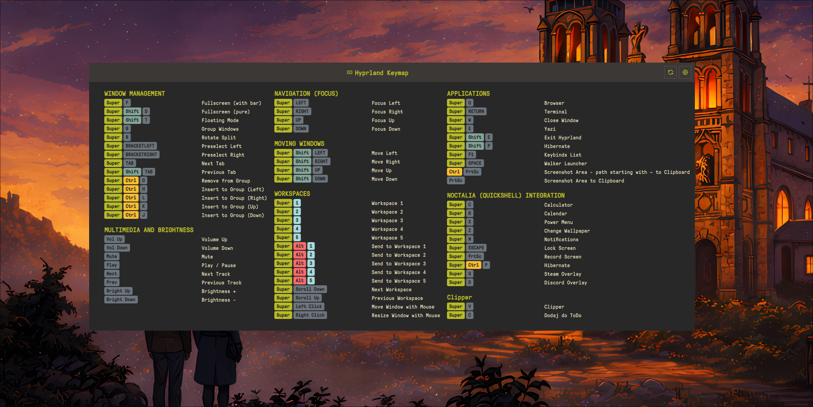

# Keybind Cheatsheet for Noctalia

Universal keyboard shortcuts cheatsheet plugin for Noctalia that **automatically detects** your compositor (Hyprland, Niri, or MangoWC) and displays your keybindings with **recursive config parsing**.



## Features

- **Automatic compositor detection** (Hyprland, Niri, or MangoWC)
- **Recursive config parsing** - follows all `source` (Hyprland/MangoWC) and `include` (Niri) directives
- **Glob pattern support** - parses `~/.config/hypr/*.conf` style includes
- **Configurable paths** - set custom config file locations in settings
- **Smart key formatting** - XF86 keys display as readable names (Vol Up, Bright Down, etc.)
- **Color-coded modifier keys** (Super, Ctrl, Shift, Alt)
- **Flexible column layout** (1-4 columns)
- **Auto-height** - adjusts to content automatically
- **IPC support** - global hotkey toggle

## Supported Compositors

| Compositor | Default Config | Format |
|------------|----------------|--------|
| **Hyprland** | `~/.config/hypr/hyprland.conf` | Hyprland config format |
| **Niri** | `~/.config/niri/config.kdl` | KDL format |
| **MangoWC** | `~/.config/mango/config.conf` | `bind=MODS,KEY,ACTION,ARGS` |

## Installation

```bash
cp -r keybind-cheatsheet ~/.config/noctalia/plugins/
```

## Usage

### Bar Widget
Add the plugin to your bar configuration in Noctalia settings. Click the keyboard icon to open the cheatsheet.

### Global Hotkey

#### Hyprland
Add to your config:
```bash
bind = $mod, F1, exec, qs -c noctalia-shell ipc call plugin:keybind-cheatsheet toggle
```
You can specify your custom Super key variable (e.g., $mainMod) in the plugin settings.

#### Niri
Add to your config:
```kdl
binds {
    Mod+F1 { spawn-sh "qs -c noctalia-shell ipc call plugin:keybind-cheatsheet toggle"; }
}
```

#### MangoWC
Add to your config:
```
bind=SUPER,F1,spawn_shell,noctalia-shell ipc call plugin:keybind-cheatsheet toggle
```

## Config Format

### Hyprland

The plugin recursively parses your main config and all `source` includes.

**Keybind format:**
```bash
# 1. APPLICATIONS
bind = $mainMod, T, exec, alacritty #"Terminal"
bind = $mainMod, B, exec, firefox #"Browser"

# 2. WINDOW MANAGEMENT
bind = $mainMod, Q, killactive, #"Close window"
bind = $mainMod, F, fullscreen, #"Toggle fullscreen"

# 3. WORKSPACES
bind = $mainMod, 1, workspace, 1 #"Workspace 1"
bind = $mainMod SHIFT, 1, movetoworkspace, 1 #"Move to workspace 1"
```

**Requirements:**
- Categories: `# N. CATEGORY NAME` (where N is a number)
- Descriptions: `#"description"` at end of bind line
- Modifiers: `$mod`, `SHIFT`, `CTRL`, `ALT`

**Source directives (automatically followed):**
```bash
source = ~/.config/hypr/keybinds.conf
source = ~/.config/hypr/apps/*.conf
```

### Niri

The plugin parses the `binds { }` block and follows all `include` directives.

**Keybind format:**
```kdl
binds {
    // #"Applications"
    Mod+T hotkey-overlay-title="Terminal" { spawn "alacritty"; }
    Mod+B hotkey-overlay-title="Browser" { spawn "firefox"; }

    // #"Window Management"
    Mod+Q hotkey-overlay-title="Close window" { close-window; }
    Mod+F hotkey-overlay-title="Fullscreen" { fullscreen-window; }

    // #"Workspaces"
    Mod+1 { focus-workspace 1; }
    Mod+2 { focus-workspace 2; }
}
```

**Requirements:**
- Categories: `// #"Category Name"` (must use this exact format)
- Descriptions: `hotkey-overlay-title="description"` attribute
- Without descriptions, actions are auto-categorized by type

**Include directives (automatically followed):**
```kdl
include "~/.config/niri/binds.kdl"
```

### MangoWC

The plugin parses `~/.config/mango/config.conf` and follows every `source=` include.

**Keybind format:**
```
# Applications
bind=SUPER,Return,spawn,ghostty
bind=SUPER,b,spawn,firefox
bind=SUPER,d,spawn_shell,noctalia-shell ipc call launcher toggle

# Window management
bind=SUPER,q,killclient,
bind=SUPER,f,togglemaximizescreen,
bind=SUPER+SHIFT,f,togglefullscreen,

# Workspaces
bind=SUPER,1,view,1,0
bind=SUPER+CTRL,1,tag,1,0

# Scroll binds (mouse wheel)
axisbind=SUPER,UP,focusdir,left
axisbind=SUPER,DOWN,focusdir,right
```

**Requirements:**
- Categories are drawn from `#` comment lines. The parser accepts a comment as a category heading when **all** of these hold:
  - After stripping any leading or trailing horizontal rule characters (box drawing `U+2500`, heavy `U+2501`, light quadruple `U+2505`, em dash `U+2014`, en dash `U+2013`, ASCII `-`, `=`, `_`), the text is 1 to 100 characters long.
  - It does not start with `(` (filters parenthetical continuations such as `# (replaces the old behaviour)`).
  - It does not contain a Unicode flow arrow (`U+2192` or `U+2190`), which filters description lines.
  - `# N. Name` is also accepted (Hyprland style).
- A heading only materialises as a section in the cheatsheet when at least one `bind`/`axisbind`/`mousebind` follows it; headings with no binds are discarded silently.
- Modifiers: `SUPER`, `SHIFT`, `CTRL`, `ALT`, `NONE` (and aliases `LOGO`, `CONTROL`, `MOD1`), combined with `+` (e.g. `SUPER+SHIFT`).
- Directives supported: `bind=`, `axisbind=` (mouse wheel), `mousebind=` (mouse buttons).
- Optional per-bind description: trailing `#"description"` overrides the auto-generated text.
- Actions without explicit descriptions are auto-formatted (`killclient` → "Close window", `view,1,0` → "Workspace 1", `focusdir,left` → "Focus Left", `set_proportion,0.5` → "Column width 50%", `moveresize,curmove` → "Move window", etc.).
- Mouse button names translate (`btn_left` → "Left Click", `btn_side` → "Mouse Side").
- `code:NN` keycodes are kept verbatim so you can still recognise the raw evdev code.
- Noctalia IPC calls via `spawn_shell,noctalia-shell ipc call ...` map to friendly labels, including `plugin:<name>` targets.

**Source directives (automatically followed):**
```
source=~/.config/mango/bind.conf
source-optional=~/.config/mango/host.conf
```

## Auto-Categorization (Niri)

When no category comment is provided, keybindings are grouped by action:

| Action prefix | Category |
|---------------|----------|
| `spawn` | Applications |
| `focus-column-*` | Column Navigation |
| `focus-window-*` | Window Focus |
| `focus-workspace-*` | Workspace Navigation |
| `move-column-*` | Move Columns |
| `move-window-*` | Move Windows |
| `close-window`, `fullscreen-window` | Window Management |
| `maximize-column` | Column Management |
| `set-column-width` | Column Width |
| `screenshot*` | Screenshots |
| `power-off-monitors` | Power |
| `quit` | System |

## Special Key Formatting

XF86 and other special keys are automatically formatted:

| Raw Key | Display |
|---------|---------|
| `XF86AudioRaiseVolume` | Vol Up |
| `XF86AudioLowerVolume` | Vol Down |
| `XF86AudioMute` | Mute |
| `XF86MonBrightnessUp` | Bright Up |
| `XF86MonBrightnessDown` | Bright Down |
| `Print` | PrtSc |
| `Prior` / `Next` | PgUp / PgDn |

## Settings

Access settings via the gear icon in the panel header:

- **Window width** - 400-3000px
- **Height** - Auto or manual (300-2000px)
- **Columns** - 1-4 columns
- **Config paths** - Custom paths for Hyprland, Niri, and MangoWC configs
- **Refresh** - Force reload keybindings

## Troubleshooting

### "Loading..." stays forever

1. Check compositor is detected: look for logs with `[KeybindCheatsheet]`
2. Verify config file exists at the configured path
3. Ensure keybinds have proper format with descriptions

### No categories found

**Hyprland:** Categories must start with `# 1.`, `# 2.`, etc.

**Niri:** Use `// #"Category Name"` format for custom categories.

**MangoWC:** `# Heading` comments become categories as described in [Config Format → MangoWC](#mangowc). Comments that start with `(`, contain `→`/`←`, or exceed 100 characters are skipped. A heading only renders when at least one bind follows it, so explanatory comments above config blocks do not leak into the cheatsheet.

### Keybinds from included files not showing

The plugin follows `source` (Hyprland/MangoWC) and `include` (Niri) directives automatically. Check logs to see which files are being parsed.

## Requirements

- Noctalia Shell 4.1.0+
- Hyprland, Niri, or MangoWC compositor

## License

MIT
