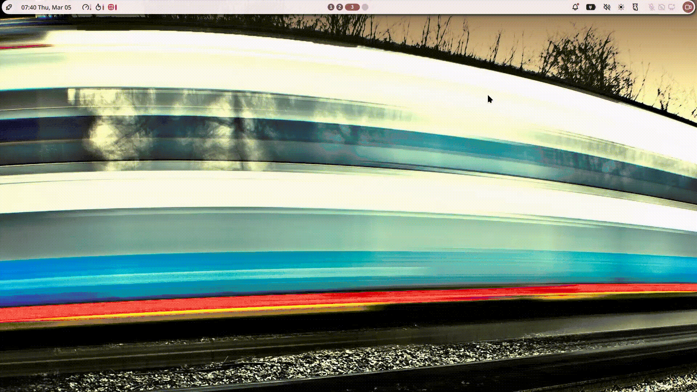
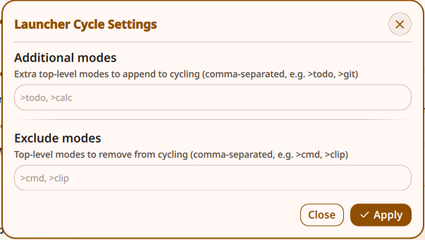

# Launcher Cycle

Cycle Noctalia launcher command modes with IPC commands, so one keybind can step through common launcher prefixes.




## What it does

- If the launcher is closed, `next` opens it with the first available mode.
- If the launcher is open, `next` cycles forward through modes.
- `previous` cycles backward through modes.

Mode order is built dynamically from top-level prefixes (`>prefix`) and cycles only those modes (subcommands like `>clip clear` are ignored).

Default base order:

1. `>file`
2. `>cmd`
3. `>win`
4. `>settings`
5. `>emoji`
6. `>clip`

Then plugin launcher providers are appended using each provider's `metadata.commandPrefix` (or plugin ID if no prefix is set), with duplicates removed.

## Settings

In plugin settings, you can configure:

- `Additional modes`: extra top-level prefixes to append to the cycle list (for example `>todo`, `>notes`).
- `Exclude modes`: top-level prefixes to remove from cycling (for example `>cmd`, `>clip`).

Both fields accept comma-separated values and ignore subcommands.

## IPC commands

Target:

`plugin:launcher-cycle`

Commands:

- `next`
- `previous`

Examples:

```bash
qs -c noctalia-shell ipc call plugin:launcher-cycle next
qs -c noctalia-shell ipc call plugin:launcher-cycle previous
```

## Keybind example

```json
{
  "keybinds": {
    "Super+Space": "qs -c noctalia-shell ipc call plugin:launcher-cycle next",
    "Super+Shift+Space": "qs -c noctalia-shell ipc call plugin:launcher-cycle previous"
  }
}
```

## Compatibility

- `minNoctaliaVersion`: `4.5.0`
