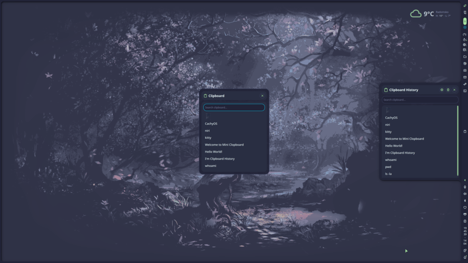

# Mini Clipper



Lightweight clipboard manager for Noctalia Shell, powered by [cliphist](https://github.com/sentriz/cliphist).

## Features

- **Bar Widget**: Clipboard icon with item count badge
- **Panel**: Searchable clipboard history with keyboard navigation
- **Floating Popup**: Centered overlay triggered via IPC command (Mod+V)
- **Image Previews**: Thumbnail support with LRU cache
- **Auto-Paste**: Paste after selection via `wtype` (optional)
- **Control Center Widget**: Quick toggle access

## Usage

- **Bar widget**: Click to open panel, right click for context menu
- **Panel**: Type to search, arrow keys to navigate, Enter to copy and close, Escape to clear search or close
- **Floating popup**: Bind `togglePopup` IPC command to a keyboard shortcut (see below)

## IPC Commands

| Command | Description |
|---|---|
| `toggle` | Toggle the panel |
| `openPanel` | Open the panel |
| `togglePopup` | Toggle floating popup |
| `clear` | Wipe clipboard history |

### Keybind Examples

**Niri** (`~/.config/niri/config.kdl`):

```kdl
binds {
    Mod+V { spawn "sh" "-c" "qs -c noctalia-shell ipc call plugin:mini-clipper togglePopup"; }
}
```

**Hyprland** (`~/.config/hypr/hyprland.conf`):

```
bind = SUPER, V, exec, qs -c noctalia-shell ipc call plugin:mini-clipper togglePopup
```

## Settings

| Setting | Default | Description |
|---|---|---|
| Max history | 50 | Maximum clipboard entries to display |
| Preview width | 80 | Characters for text preview |
| Image previews | On | Show image thumbnails |
| Auto-paste | Off | Paste after selecting (requires wtype) |
| Auto-paste delay | 300ms | Delay before auto-paste |
| Floating popup | On | Enable floating popup via IPC |
| Icon color | none | Bar widget icon color |
| Show item count | On | Item count badge on bar widget |

## Requirements

- `cliphist` — clipboard history manager
- `wl-clipboard` — Wayland clipboard utilities (`wl-copy` / `wl-paste`)
- `wtype` — (optional) for auto-paste feature
