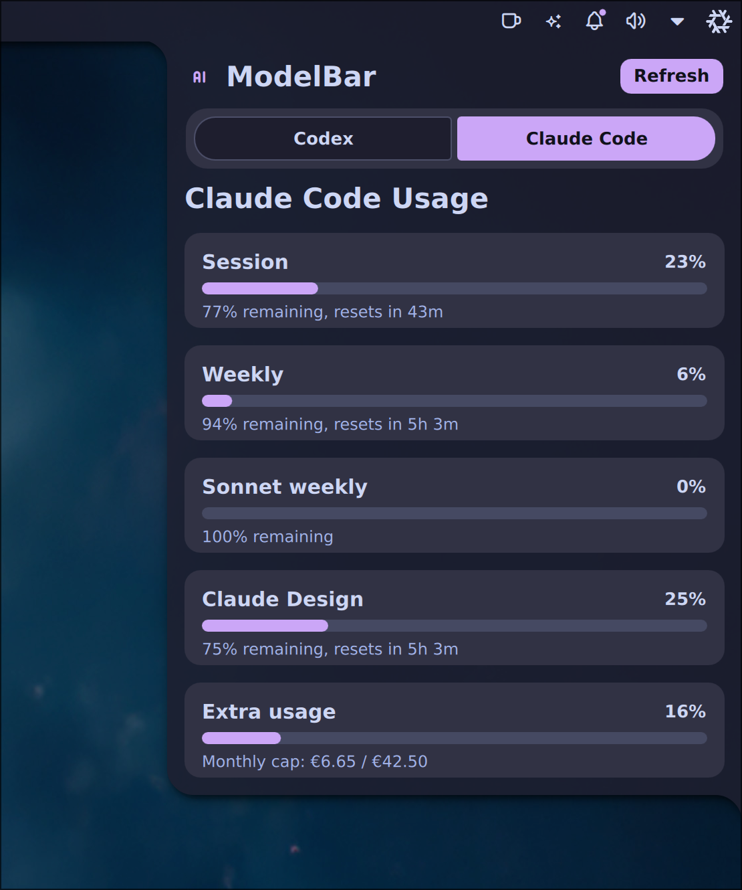

# ModelBar

Live Codex and Claude Code quota telemetry for Noctalia. ModelBar turns your bar into a small AI fuel gauge: quick status in the menu bar, tabbed provider detail in the popup, and real usage windows instead of guesses from local session logs.



## What It Shows

- Codex and Claude Code in a compact Noctalia bar widget.
- Tabbed provider details with clean progress bars.
- Session, weekly, model-specific, Claude Design, Claude Routines, and Extra usage windows when the provider returns them.
- Claude Extra usage as real currency spend/cap, including minor-unit normalization like CodexBar.
- A conservative 5 minute refresh cadence with cache and backoff protection for Claude.

## Why This Exists

The upstream Noctalia `model-usage` plugin is useful visually, but it can drift because it infers too much from local session data. ModelBar uses live provider usage endpoints where possible:

- Codex: ChatGPT/Codex OAuth usage API, with `codex app-server` as fallback.
- Claude Code: Claude OAuth usage API from local Claude Code credentials.

Local logs are only used for small local stats, not for rate-limit math.

## Requirements

- Noctalia v4
- Python 3
- OpenAI Codex CLI authenticated with `codex`
- Claude Code authenticated with `claude`

ModelBar reads existing local auth files and never prints tokens. If OAuth refresh is needed, credentials are updated atomically with `0600` permissions.

## Install From GitHub

Clone the repo directly into Noctalia's plugin directory:

```sh
mkdir -p ~/.config/noctalia/plugins
git clone https://github.com/DigitalPals/ModelBar.git ~/.config/noctalia/plugins/modelbar
```

Enable the plugin in `~/.config/noctalia/plugins.json`:

```json
{
  "states": {
    "modelbar": {
      "enabled": true,
      "sourceUrl": "https://github.com/DigitalPals/ModelBar"
    }
  }
}
```

Restart Noctalia, open Noctalia settings, and add `ModelBar` to your menu bar.

On this NixOS setup, the safe restart path has been:

```sh
pkill quickshell
hyprctl dispatch 'hl.dsp.exec_cmd("noctalia-shell")'
```

If you are using a different Noctalia launcher, restart it the same way you normally restart Noctalia.

## Updating

If you installed from the repo:

```sh
cd ~/.config/noctalia/plugins/modelbar
git pull --ff-only
```

Then restart Noctalia.

## Settings

ModelBar exposes these settings through the Noctalia plugin settings panel:

- `Provider mode`: Codex, Claude Code, or automatic.
- `Bar metric`: remaining percent, used percent, or credits.
- `Refresh interval`: 1 to 30 minutes, defaulting to 5 minutes.
- Binary and config paths for `codex`, `claude`, `~/.codex`, and `~/.claude`.

## Notes For NixOS

No special Nix module is required. Keep the plugin checkout mutable under `~/.config/noctalia/plugins/modelbar` or symlink it from your own source directory. Make sure `python3`, `codex`, and `claude` are available in the environment that launches Noctalia.

## Credits

ModelBar is built for Noctalia and borrows its live-data approach from CodexBar:

- CodexBar: https://github.com/steipete/codexbar
- Noctalia plugins: https://github.com/noctalia-dev/noctalia-plugins
