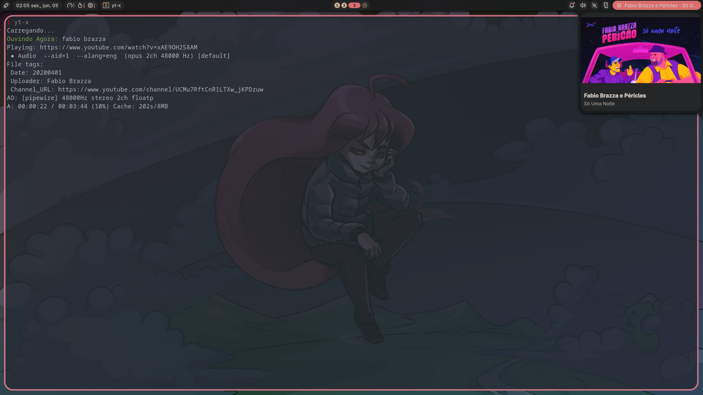

# MPV Plugin for Noctalia

A plugin for the [Noctalia](https://noctalia.dev/) shell for controlling [mpv](https://mpv.io/).
It provides a bar widget displaying the current playback state and song name,
with a hover panel showing full track details and album art.



## Features

- Shows playback status icon (playing / paused / stopped) and current song name in the bar
- Hover panel with title, artist, and YouTube thumbnail
- Configurable left, right, and middle click actions
- Works with anything mpv plays: local files, streams, YouTube via [yt-x](https://github.com/Benexl/yt-x)

## Requirements

- Noctalia shell
- mpv with IPC socket enabled
- [`socat`](http://www.dest-unreach.org/socat/) available in `$PATH`

## Installation

Add the following to your `~/.config/mpv/mpv.conf`:

```ini
input-ipc-server=/tmp/mpvsocket
```

Then copy this directory into your Noctalia plugins folder, enable the plugin from Noctalia's settings, and restart Noctalia.

## Configuration

| Setting | Default | Description |
|---------|---------|-------------|
| Left click | Play / Pause | Action triggered by left-clicking the widget |
| Right click | Next track | Action triggered by right-clicking the widget |
| Middle click | Previous track | Action triggered by middle-clicking the widget |

Available actions: Next track, Previous track, Play / Pause, Stop.

## Credits

Based on [noctalia-mpd](https://github.com/ido50/noctalia-mpd) by [Ido Perlmuter](https://github.com/ido50).

## License

MIT - see [LICENSE](LICENSE) for details.
