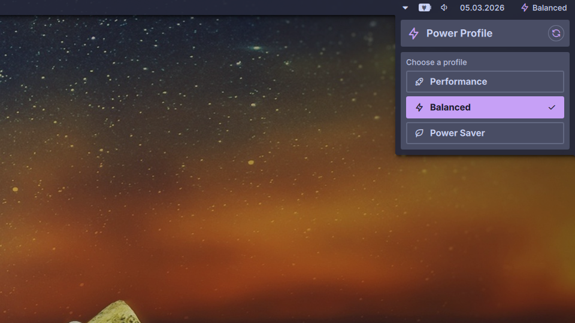

# Power Profile Plugin

A power profile switcher plugin for Noctalia that shows the current power profile in the bar and lets you switch between profiles with a click.

## Features

- **Status Indicator**: Shows the current power profile in the bar with an icon and label
- **Quick Switcher**: Click the widget to open a panel with all available profiles
- **Degraded Warning**: Profiles that are degraded show an alert icon as a visual warning
- **Refresh**: Right-click the widget and select Refresh to manually update the profile list

## Requirements

- [`power-profiles-daemon`](https://gitlab.freedesktop.org/upower/power-profiles-daemon) must be running on your system
- `powerprofilesctl` must be available in your PATH

## Usage

1. **Click** the bar widget to open the profile switcher panel
2. **Click a profile** in the panel to activate it
3. **Right-click** the bar widget for a context menu with a refresh option

The current profile is automatically refreshed every 5 seconds. You can also trigger a manual refresh via the right-click context menu.

## Profiles

The plugin supports any profiles exposed by `power-profiles-daemon`. Common profiles are:

| Profile | Icon | Description |
|---|---|---|
| `power-saver` | leaf | Reduces performance to save energy |
| `balanced` | bolt | Default balanced profile |
| `performance` | rocket | Maximum performance (may show degraded warning) |

