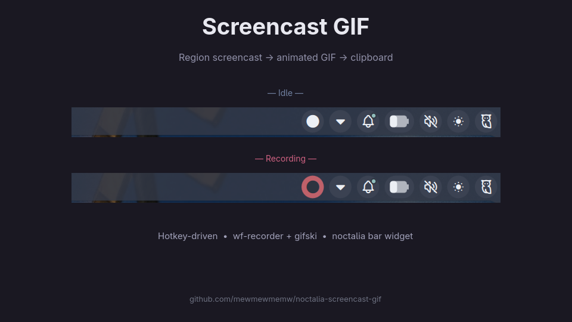

# Screencast GIF



A toggle-style screen recorder for [Hyprland](https://hyprland.org/) /
[Sway](https://swaywm.org/) / any wlroots-based Wayland compositor that:

- selects a screen region with `slurp`,
- records it with `wf-recorder`,
- converts the result to an animated `.gif` with `gifski`,
- copies the GIF straight to the Wayland clipboard (as `image/gif`),
- saves the file alongside in a configurable directory,
- shows a **red pill in the noctalia bar** while recording is active, and
  turns back to neutral when the GIF is ready.

Press your hotkey once to pick a region and start recording, press again to
stop and grab the GIF — both from the keyboard and by clicking the pill.

## Why

Most existing Wayland screen recorders either give you a `.mp4` or open a GUI.
There was no off-the-shelf "press hotkey, draw region, get a GIF in clipboard,
with a visible recording indicator" tool — so this plugin glues the best
existing pieces (`wf-recorder` + `gifski`) together and exposes the whole
thing through a noctalia bar widget.

## Requirements

| Tool | Purpose | Arch package |
|---|---|---|
| [`wf-recorder`](https://github.com/ammen99/wf-recorder) | screen capture | `wf-recorder` |
| [`gifski`](https://gif.ski/) | high-quality GIF encoding | `gifski` |
| [`slurp`](https://github.com/emersion/slurp) | region selection | `slurp` |
| `ffmpeg` | extract frames from the captured mp4 | `ffmpeg` |
| `wl-clipboard` | clipboard plumbing (`wl-copy`) | `wl-clipboard` |
| `flock` (util-linux) | invocation locking | `util-linux` |
| `notify-send` | start/end notifications (optional) | `libnotify` |

```bash
sudo pacman -S --needed wf-recorder gifski slurp ffmpeg wl-clipboard libnotify
```

## Usage

### Bar widget

- **Left click** — start/stop recording (same as the hotkey)
- **Right click** — open plugin settings

### Hotkey (Hyprland)

Bind any modifier+key to the plugin's IPC `toggle`:

```ini
bind = SHIFT, XF86Cut, exec, qs -c noctalia-shell ipc call plugin:screencast-gif toggle
```

The first press picks a region with `slurp`. The second press stops the
recorder, runs the GIF conversion, and copies the GIF to your clipboard so
you can paste it straight into Telegram / Discord / Element / etc.

## Settings

| Setting | Default | Notes |
|---|---|---|
| Output directory | `~/Screenshots` | Tilde is expanded. Created if missing. |
| Frame rate | `20` | 15–25 is a good balance between smoothness and file size. |
| Auto-stop after (seconds) | `120` | Safety net so you don't leave it recording forever. `0` disables. |

The settings are passed to the script via environment variables (`FPS`,
`MAX_SECS`, `OUTDIR`), so direct invocations of the script can override them
the same way.

## How it works

`screencast-gif.sh` is a toggle:

- **First call** acquires a lock, asks `slurp` for a region, rounds the
  coordinates to the nearest even values (h264 + yuv420p requires this), and
  starts `wf-recorder --no-dmabuf -D --pixel-format yuv420p` writing to a
  per-invocation directory under `/tmp/screencast-gif/`. The PID and that
  directory are written to `/tmp/screencast-gif.pid`. A backgrounded watchdog
  re-invokes the script after `MAX_SECS` to enforce the auto-stop.
- **Second call** sees the live PID in the pidfile, releases the lock
  immediately (so a third invocation can start a brand-new recording while
  conversion is still running), sends `SIGINT` to `wf-recorder`, waits for it
  to flush the mp4, then runs `ffmpeg` to extract frames and `gifski` to
  encode the GIF, copies it to the clipboard, and saves it to `OUTDIR`.

The QML side (`Main.qml`) polls `/tmp/screencast-gif.pid` once a second to
keep the bar widget's `recordingActive` flag in sync. Cheap, robust, and
independent of the daemon's notification quirks.

### Notable quirks handled

- **`Failed to copy frame too many times` from wf-recorder** — fixed by
  passing `--no-dmabuf` (forces CPU buffer copy instead of DMA-BUF).
- **Single-frame GIFs from static regions** — wf-recorder defaults to
  damage-tracking and only requests new frames when the screen changes,
  which collapses a quiet recording to a single frame. `-D` /
  `--no-damage` forces continuous capture.
- **Odd coordinates from slurp on fractional-scale monitors** — rounded to
  even values before being passed to `wf-recorder` (h264 + yuv420p won't
  encode odd dimensions).
- **`flock` leaked into the recording subprocess** — every backgrounded
  child closes inherited fds before exec'ing, so the recorder doesn't
  pin the lock and outlive its purpose.
- **Lock held during slow GIF conversion** — released as soon as the
  recorder is signalled, so a new recording can start immediately.
- **`wl-copy` keeping test harnesses alive** — `wl-copy` daemonises to
  serve the clipboard contents until they're replaced. The daemon
  inherits all parent fds; the script strips them before invoking
  `wl-copy` so test harnesses (and any pipe-driven caller) can reach EOF.

## Advanced

State file paths can be overridden via env vars (mostly for tests and
scripted automation):

| Env var | Default |
|---|---|
| `SCREENCAST_GIF_PIDFILE` | `/tmp/screencast-gif.pid` |
| `SCREENCAST_GIF_LOCKFILE` | `/tmp/screencast-gif.lock` |
| `SCREENCAST_GIF_WORKDIR` | `/tmp/screencast-gif` |
| `SCREENCAST_GIF_LOG` | `/tmp/screencast-gif.log` |
| `SCREENCAST_GIF_REGION` | (unset — fall back to `slurp`) |

The bar widget's polling assumes the defaults, so changing the pidfile
location will hide ongoing recordings from the bar pill — only do it
for tests or one-off scripted recordings.

## Development

Source, issue tracker, and a bats-core test suite live at
[github.com/mewmewmemw/noctalia-screencast-gif](https://github.com/mewmewmemw/noctalia-screencast-gif).

## License

MIT.

## Credits

- [wf-recorder](https://github.com/ammen99/wf-recorder) by Ilia Bozhinov
- [gifski](https://github.com/ImageOptim/gifski) by Kornel Lesiński
- The [screen-shot-and-record](https://github.com/noctalia-dev/noctalia-plugins/tree/main/screen-shot-and-record)
  noctalia plugin, which served as the reference for the bar-widget
  recording-state pattern.
