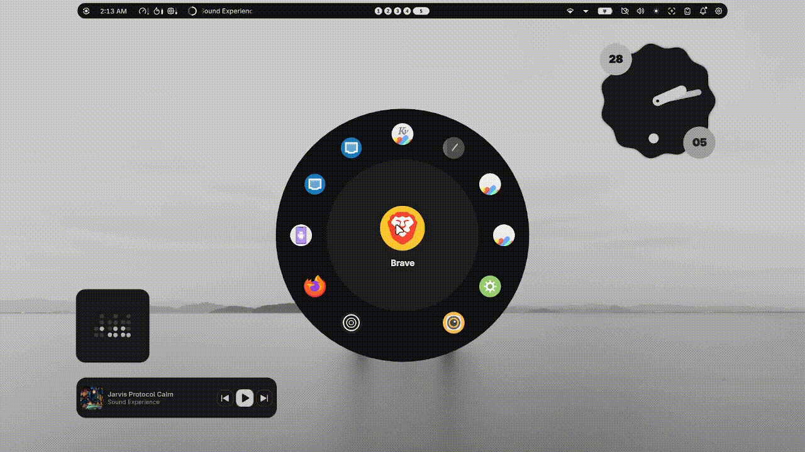

# 📀 Vinyl Launcher for Noctalia

[](https://github.com/noctalia-dev/noctalia-plugins)
[](https://opensource.org/licenses/MIT)
[](https://noctalia.dev)

A premium, rotational disk-based application launcher for the **Noctalia** shell. Featuring a modern glass-morphism aesthetic, smooth physics-based animations, and a highly efficient keyboard-first workflow.

---

## ✨ Preview



*Experience the smooth rotation and modern UI of Vinyl Launcher.*

---

## 🚀 Features

- **💎 Glass-morphism UI**: A stunning semi-transparent disk interface with frosted borders and neon selection glows.
- **🌀 Physics-based Rotation**: Smooth, momentum-based scrolling designed for mouse, trackpad, and touch.
- **🎧 DJ Jog Wheel Mode**: Laptop users can use their trackpad like a DJ deck—swipe with two fingers to spin the disk with realistic inertia.
- **⌨️ Keyboard Optimized**: 
  - **Instant Search**: Start typing to filter apps immediately.
  - **Arrow Navigation**: Use `Left/Right` or `Up/Down` to glide through your apps.
  - **Fast Launch**: Press `Enter` to launch the centered application.
- **🔌 Native Integration**: Built specifically for Noctalia, utilizing native application providers and custom sorting logic.
- **📏 Perfect Proportions**: Dynamic absolute scaling that perfectly fits any monitor resolution natively.

---

## 🛠️ Usage

### Installation
1. Move this folder to your Noctalia plugins directory.
2. Enable the **Vinyl Launcher** in your Noctalia settings.

### Controls
| Action | Key / Gesture |
| :--- | :--- |
| **Search** | Just start typing |
| **Rotate** | `Arrow Keys`, `Tab`, Mouse Scroll, or **Two-Finger Trackpad Swipe** |
| **Select** | `Enter` or `Click` centered icon |
| **Close** | `Escape` |

### IPC Command
You can toggle the launcher via terminal or keybind:
```bash
quickshell -p noctalia-shell ipc call plugin:vinyl-launcher space
```

---

## 🤝 Contributing

This plugin was developed as a modern, high-performance alternative to the standard launcher. We welcome contributions!

1. Fork the [Noctalia Plugins](https://github.com/noctalia-dev/noctalia-plugins) repository.
2. Implement your changes.
3. Submit a Pull Request.

---

<p align="center">
  Made with ❤️ by <b>c1ph3r-1337</b>
</p>
